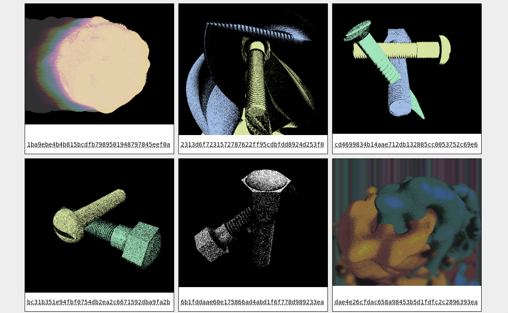

# gitsnaps

visual source control tool for creative coding



# usage:

`gsnap` to commit last screenshot & all files
`gview` to view a gallery of commits with screenshots

setup:

```
npm install
# in bashrc:
alias gsnap="node ~/path_to/gitsnaps/index.js"
alias gview="node ~/path_to/gitsnaps/render.js"
```

note: for something breaks on node 10, use node 8
